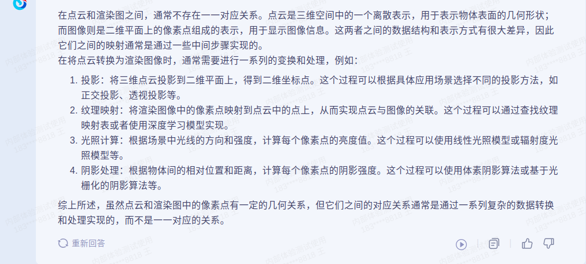

## 2023.04.08 工作记录
1. ~~北京开会购买车票事项，晚上8点之前完成沟通~~
2. ~~TVCJ论文审稿事宜~~
    * ~~袁梦参与~~
3. ~~晚上大创开会~~
4. ~~初期实验方案设计~~
    * 相关论文阅读
5. ~~筹备PaperABC论文更新事项~~
    * ~~segment anything paper~~
6. ~~B站商务合作~~

## 2023.04.09 工作记录
1. 撰写审稿意见
2. 整理初期实验结果，评估实验设计方案
    * 核实测试代码（核实完毕，发现现在的程序可能训练成本相对较高，目前的想法就是改成ShapeNet预训练，可以在单卡3090上进行训练 refer to I2P-MAE）
    * 整理Pre-training论文，评估训练代价 (I2P-MAE方案可行)
3. 相关论文阅读
4. 其他
5. 未完成事项
    1. 小程序咨询
    2. 火车票购置
    3. 其他

## 2023.04.10 工作记录
1. ~~医疗小程序咨询~~
    * ~~先做一个简单的就可以了，后续的东西只要能流出来接口，然后后期在开发。分阶段，分几个阶段给钱。分三个阶段都是有可能的。算法在小程序上能跑就是第一个阶段。~~
    * ~~第二个阶段可以实现小规模的测试，基本的预约功能。~~
    * ~~第三个阶段是完整的事情。~~
    * ~~小项目，没有多少钱。 2+2+3~~
    * ~~需要提供输入输出数据~~
2. ~~火车票购置事项~~
3. 审稿意见撰写
4. soft-clip for 3d 想法成型
5. ~~服务器上实验运行~~
6. ~~解决A10服务器配置问题~~
    1. ~~感谢毛仁亿师弟帮忙解决~~
7. 整理SOTA
    * 自监督学习
    * 有监督学习
    * Vote 测试？
8. ArXiv更新
9. 教学项目相关
    * 还是买服务器，4台4卡A800
    * 编故事 基于ChatGPT的应用在各个课堂中会用到，ML,DL 基于大模型的实验
    * 总体还是教学的项目 北京就是大模型发展非常快 支撑5门课 
    * 2 3 段 每段10多行
    * 大模型和我们课程的关系
    * 思路
        * 大模型的飞速发展，产业带来了价值，也给教育带来了机会
        * 大模型如何助力核心课程
        * 大模型参数量巨大，训练推理亟需高性能计算平台
        

## 2023.04.11 工作记录
1. 整理实验结果，提前发资料至群里
    * 完成，后续继续整理
        * ~~3-fold few-shot~~
        * 3-fold finetune modelnet
        * 2-fold segmentation 15h
        * 2-fold scanobjectNN 7h
2. 验证一下，少epoch的预训练是不是就够了。
    * 还是别了，保持和原始论文中一致的方案吧
3. 读论文，查资料，小数据集下MAE的训练是否足够
4. 整理后续还需要做的实验，正在跑的实验
5. 整理SOTA
4. ~~思考小数据集下预训练MAE的实验方案~~
    * ~~预训练数据集shapenet 训练集和测试集均缩至原始的1/10~~
    * ~~下游任务数据集处理采取同样方式~~
5. PaperABC更新
6. ~~审稿意见撰写~~
    * 举出一些intra-model的对比学习方法
    * local-global互信息最大化的文章
    * 明天上午11点之前完成审稿意见撰写
9. 推理服务器，数据服务器
    * 数据服务器的费用要透明
    * 我们自己搞个数据服务器
10. **准备讨论班**

## 2023.04.12 工作记录
1. ~~PaperABC更新~~
    * ~~arxiv~~
2. ~~审稿意见整合~~
3. 小程序公司查找
4. 讨论班
    * 论文阅读
    * PPT制作
    * 群里发通知
5. ~~整理2-fold PointMAE实验结果~~
    * ~~整理完毕，总体的结论就是multifold mae有效~~
6. 整理最优epoch验证实验
7. ~~代码理解~~
    * ~~ScanObjectNN 训练时候测试了吗？ 其他的实验也类似~~
    * ~~few-shot是如何设置的~~

## 2023.04.13 工作记录
1. 昨日未完成事项
    * 实验
        * 最优epoch实验
        * 小数据集下确定epoch的最优轮数
        * 小数据集下对比2-fold pointmae和vanilla pointmae
            * fintuning 
            * few-shot
        * 给出小数据集下预训练的一些结论
    * 联系小程序公司
2. ~~PaperABC更新~~
3. 论文阅读，idea更新
4. random mask层面新实验
    * 每一个点云随机random mask 多次

## 2023.04.14 工作记录
1. 运行实验，观察实验结果，分析
2. 联系小程序公司
3. 思考GF背景   
    * 之前比较聚焦于空中
    * 数据的模糊 打击的时效性 增强的评测 对生成的数据的评测
        雨雾两种类型：
        1. 背景 
        2. 遮挡
        是否对以上就行区分？每一种对应着不同的物理规律，目标类型复杂
        激光雷达
        不同视角下 结构 时序 三维一致性
        
        生成运动模糊图像信息
        烟雾 视角 运动模糊 对应生成和评测

        特征分布上进行评测 或者 下游任务性能涨点评测
        代理任务设计：融合物理属性的代理任务，比如烟雾、角度、新视角、运动、模糊参数

        第七页：
        基于自监督学习的数据匹配评测
        基于自监督学习的下游任务的评测

        
        元学习如何作为广义的数据增强？逻辑搞清楚
        数据生成的时候 考虑去烟 去雾 去雨 可考虑cycleGAN

        可见光 红外
        * 课题一：物理规律的生成 （合理性 真实性）
            * 模拟烟雾的物理规律的图像生成
            * 满足多视角一致性物理规律的图像生成
            * （质量）满足motion-blur或充斥噪声的图像生成
        区别于课题一中的评测方法 更高级的评测方法（科学问题）
        * 课题二：基于自监督学习的图像质量评测（数据层面） 充分性 全面性
            * prompt-learning， 
            * 融合物理规律的数据评测的精准性
                * 代理任务 判别物理规律 判别器 （数据层面）
                <!-- * 对比学习 做下有任务 （下游） -->
            * 基于Prompt learning的性能提升验证 SAM 弱监督
            * 基于自监督学习的下游任务性能提升 不需要标注 下游任务支持的更多 传统的方法需要标签 （自监督）
            * 原有的基于下游任务涨点需要更多的注释信息
                * 生成的数据不一定有充足的标注，标注麻烦
            * 
        *   

## 2023.04.17 工作记录
1. 汇总实验结果，分析。
2. GF项目
    * 分配写本子任务
    * Prompt learning调研
    * 需求内容撰写
    * 科学问题：
3. 表征学习现阶段论文分析
    * 难度，卷不卷

## 2023.04.26 工作记录
1. ~~私有云服务器购买对比~~
2. 开会
3. 看论文，思考idea。
4. 第二个、第三个、第五个、第六个 decision making action 3 6优先级更高 递进
5. 一汽设计院：单视角、多视角 输入的可能性 生成的方法调研 满足物理约束 编辑光照 后处理编辑

## 2023.04.27 工作记录
1. ~~ArXiv更新~~
2. ~~一汽AIGC内容分配，自己任务思考~~
3. Idea构思
    * 
4. ~~长春站取车票~~
5. 存钱
6. MXM-CLR代码整理

## 2023.05.08 工作记录
1. Arxiv更新
2. 取显卡，送马老师
3. 准备去水务办公事项 

## 2023.05.09 工作记录
1. Stable Diffusion项目pending
2. 刷Arxiv，看一下大家都在做什么
    * 自监督
    * 3D大模型
    * 找茬
    * multi-fold
    * 统一3D生成和理解
        * 利用3D生成模型的知识 Point-e

## 2023.05.10 工作记录
1. 挂实验，检查代码正确性
2. arxiv更新
3. 处理私有云，硬盘事项
4. 构思新想法

## 2023.05.11 工作记录
1. Arxiv更新
2. Few-Shot learning 的实验代码
3. Prompt-tuning Stable Diffusion / LoRA
3. 新idea+论文阅读
4. 其他
    * 现在有没有融合2D场景图的3D场景理解
    * 大家都在做单个prompt，能不能做多个prompt或者temlate + learnable prompt
    * 马老师，构思布局整体+局部

## 2023.05.12 工作记录
1. Arxiv更新
2. 宏观思考3D表征学习领域，给出未解决的问题。
    * 这些自监督学习下的方法，给出的表征适合做生成吗？适合做更加细粒度的任务吗？
    * 目前在Shapenet上或者其他数据集上预训练方法，他们真的能在in the wild场景下做的很好吗？
        * 真实世界的点云是怎样的？这些方法能解决真实世界的场景吗？ https://arxiv.org/pdf/2104.10154.pdf
        * 面向残缺点云
        * 以Recon为首的方法，都是在单一物体，干净背景下设置，这样的表征是和真实世界的噪音分布是有很大GAP的   
            * 带噪、背景复杂
        * 动态点云，而不是静止的点云（被人做了，YILI）现在不能在做点云的表征了，都开始做动态点云了。
    * 
3. 查本子相关资料
    * 环境传感器相关资料查找
        * 分类：
            * 应用类型：温度、湿度、空气质量、紫外线、水质等
            * 行业类型：政府、商业、工业
        * 工业环境传感器
            * 用于检测和记录重要工业参数（压力、温度、流速、堵塞检测）
            * 传感器类型：
                * 光传感器，容易被遮挡，需要清洁、无尘、无水的环境设置
                * 感应式传感器：如利用磁性检测金属物体
                * 电容式传感器：检测非金属物体引起的电容
                * 位置传感器：自动测量场景
                * 力传感器：检测表面压力信号
                * 振动传感器：检测振动信息
                * 液体传感器：
            * 行业趋势
                * 目前多使用无线传感器，安装维护方便
                * 检测机械设备：无线传感器可以方便地进入无法进入的位置、旋转机械、危险或受限区域以及移动设备
                * 数据记录：无线传感器还用于收集环境监测数据，例如监测冰箱内的温度或监测核电站溢流水箱的水位、监测地下或地表水的水质
                * 化学过程检测：利用传感器网络可以监测和控制化工过程中物料的浓度分布
            * 主要国际公司
                * 博世Sensortec
                * Sensirion
                * AMS股份公司
                * 霍尼韦尔
                * 西门子
                            * 欧姆龙
                * 力登
                * 德州仪器
                * 施耐德电气
                * 安费诺
            * 性能指标
                * 超高温震动传感器：传感器最高温度>850摄氏度，  
            * 主要构成和主要指标
                * 温度振动传感器：温度标定范围（-80~2800）、频率响应范围（50Hz~3.0kHz）
                * 压力传感器：压力测量范围（1kPa~110kPa）、测量精度（优于0.01%FS）
                * 深海水声传感器：最大工作水深（5000m）
                * 实时监测传感器：非线性误差（<0.5%FS）、压力精度0.5FS、在线测量误差< 2微米

4. 3D few-shot learning 设置
    * Stable Diffusion 实验安排
* 4D 点云
https://sise.uestc.edu.cn/zhinengchuanganqi.pdf

## 2023.05.13 工作记录
1. 调研4D点云工作
2. 调研Yi Li的最近两年的工作

## 2023.05.14 工作记录
1. 调研4D点云工作
2. CVPR上接受的文章调研 关于4D点云理解
3. ICLR上接收的文章调研 关于4D点云理解

## 2023.05.15 工作记录
1. ~~Arxiv更新~~ 
2. 调研4D点云自监督学习工作
    * 4D点云领域自监督未解决的问题
        * 多模态引导
        * 下游评测目前还是3D任务，并没有办法体现出4D或者时序信息，能否设计更加鲁棒的下游评测方法
    * 无监督的tracking如何解决？（14日看到过有文章解释）
    * long-range的问题，有监督中怎么出现的？怎么解决的？ 视频领域应该有？  
    * 动态点云的下游任务有哪些？
        * 语义分割
    * 四篇自监督的文章中的相关工作整理
    * 是不是应该设计一个4D相关的下游任务，自动驾驶中有没有这样的任务？如果没有如何定义
        * 参考C2P这篇文章
        * 参考HOI4D这篇文章
3. ~~送材料~~
4. ~~学院群事务~~
5. 精读4篇自监督论文
6. 科学问题-- 子课题 -- 每课题200字 找2-3篇支撑文献，理清文章逻辑

## 2023.05.16 工作记录
1. 整理本子需要做的事情
    * 背景、研究意义要写
    * 课题二照顾
    * 整体逻辑
        * 买数据训练--》生成数据--》质量评估（物理特征）| 质量评估（模型增益）
    * 备选方案逻辑
2. Arxiv更新
    * Bridging the Domain Gap: Self-Supervised 3D Scene Understanding with Foundation Models
    * SRRM: Semantic Region Relation Model for Indoor Scene Recognition
    * PLIP: Language-Image Pre-training for Person Representation Learning
    * ULIP-2: Towards Scalable Multimodal Pre-training For 3D Understanding
3. 4D点云视频自监督理解未解决的问题

## 2023.05.18 工作记录
1. ~~处理本子事项~~
2. 课题二内容把关
3. 科研事项
    * SAM的一些简单实验
       * ~~ShapeNet数据集基于渲染图的everything分割~~
       * 3D zero-shot 分割的工作有多少
4. Arxiv速览

## 2023.05.19 工作记录
1. 调研想法
    * 使用文本来驱动场景内部单个物体的part-level的分割
    * 点云的点和投影或者渲染图的像素点之间有对应关系吗
        
    * 点和像素之间的对应关系
        * PartSlip是采用超点的概念完成的，可以借鉴
        * 点云到图像的投影，这个对应关系在光栅化的时候可以知道
    * 目前存在part-level标注的3D场景数据集吗？
2. 整理文章
    * PartSLIP: Low-Shot Part Segmentation for 3D Point Clouds via Pretrained Image-Language Models
    * Large-scale Point Cloud Semantic Segmentation with Superpoint Graphs.
    * SegGroup: Seg-Level Supervision for 3D Instance and Semantic Segmentation
3. 本子
    * 白同源课题
    * 大模型本子子课题构思

