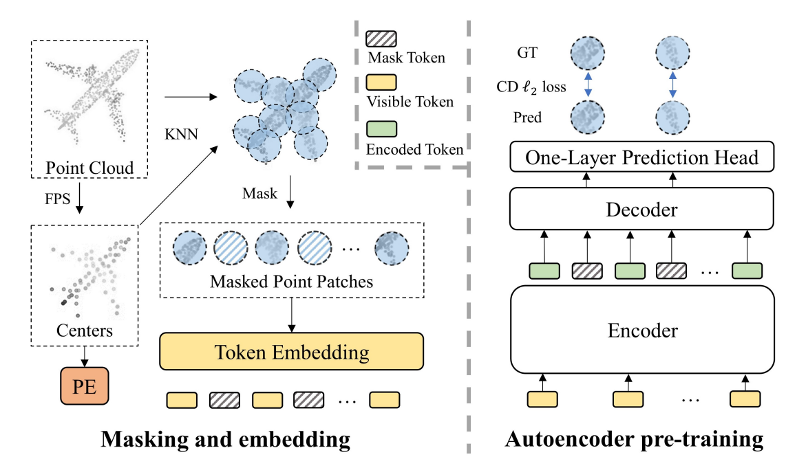
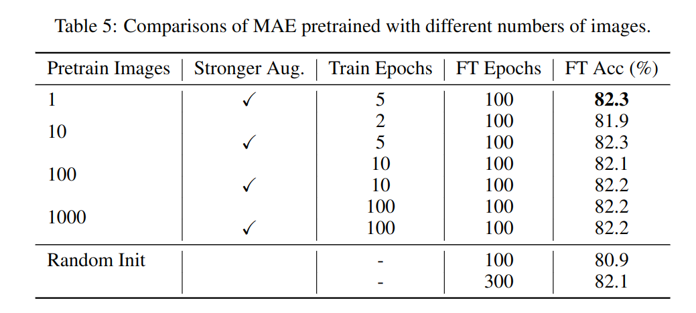

## Multifold Cross-modal Masked Pre-training 初期实验方案设计

### 实验一 Vanilla PiMAE Pre-training
由于torch版本的不同，同时原始repo也没有给出具体的torch版本信息，当使用和PiMAE相同的batchsize (128)设置时，会报错，这个error是由于torch版本不同带来的bug。当降低batchsize至100时，可以正常预训练。

#### 疑问
1. 为什么经过SUN RGB-D数据集的预训练之后，在SUN RGB-D数据集上微调3DETR还需要1080轮呢？毕竟3DETR的training from the scratch才是1080,那这样的话，预训练的意义是什么呢？
    * 在PointMAE的issue中，原作者进行了回复。简单来说，就是看效果，finetune的epoch如果较少的话，那效果就不行。

### 20230411 实验 PointMAE vs 2-fold PointMAE

**Baseline**:
采用原始的PointMAE模型，发表于ECCV2022。属于纯点云模态的mask pre-training模型。并不是当前点云自监督预训练领域的SOTA.

**2-fold PointMAE**:
每一个点云random mask两次，其余settings均和baseline保持一致。

**预训练数据集**：
1. ShapeNet-55

**下游任务**：
1. ModelNet40 finetuning task
2. ModelNet40 10-fold few-shot learning task
    * 5-way, 10-shot 
    * 5-way, 20-shot
    * 10-way, 10-shot
    * 10-way, 20-shot

**实验结果**
1. Finetuning on ModelNet40 dataset.

|  Methods | Accuracy  |
|---|---|
| <font color=red>ReCon (SOTA)</font> | <font color=red>94.7%</font> |
| Point-MAE | **93.8%**  |
| 2-fold Point-MAE | 93.3% |
| 3-fold Point-MAE | 93.23% |


发现：
* 2-fold Point-MAE在modelnet上进行finetuning，最终的效果有所下降。目前分析出来的原因是可能是2-fold PointMAE的预训练时间过长，从而导致过拟合。缩短预训练时长的实验目前正在刷。
* 也有可能是2次random mask之后，训练目标不一致造成。


2. Few-shot learning on ModelNet40 dataset.

|  Methods | 5-ways,10-shot  | 5-ways,20-shot | 10-ways,10-shot | 10-ways,20-shot  |
|---|---|---|---|---|
|  <font color=red>ReCon (SOTA)</font> | <font color=red> 97.3%$\pm$1.9</font> | <font color=red> 98.9%$\pm$1.2 </font> | <font color=red>93.3%$\pm$3.9</font> | <font color=red>95.8%$\pm$3.0</font>  |
|  Point-MAE | 96.3 $\pm$ 2.5 | 97.8 $\pm$ 1.8 | 92.6 $\pm$ 4.1 | 95.0 $\pm$ **3.0**  |
|  2-fold Point-MAE | **96.6** $\pm$ 2.62 | **98.0** $\pm$ **1.0** | 92.8 $\pm$ 3.96 | 95.2 $\pm$ 3.11  |
|  3-fold Point-MAE | 96.5 $\pm$ **2.06** | **98.0** $\pm$ 1.34 | **92.85** $\pm$ **3.74** | **95.35** $\pm$ 3.17  |

发现：
* 2-fold PointMAE在few-shot learning上均带来了提升。可能是因为预训练阶段，对于每一个shape都学习了更多的信息，最终学出来的representation在小样本设置下性能更优。


3. Part Segmentation task on ShapeNetCore dataset

|  Method | $mIoU_C$  |  $mIoU_I$  |
|---|---|---|
|  PointMAE  | ---  |  86.10%  |
|  2-fold PointMAE | 84.80%  |  86.22%  |
|  ReCon (CVPR23)   |  84.80%  | 86.40%  |
|  PointM2AE (NIPS22) | 84.86%  |  86.51%  |
|  I2P-MAE (CVPR23)  | 85.15%  |  86.76%    |


4. ScanObjectNN 分类任务

|  Method | ACC  |
|---|---|
|  PointMAE  |  85.18% |
|  2-fold PointMAE | 84.73% |
|  I2P-MAE (CVPR23)  | 90.11% |
|  ReCon (CVPR23)  | 90.63% |


~~**现阶段问题**~~
1. ~~multifold mask setting 相对于vanilla PointMAE增大了batchsize，同时预训练阶段+微调大概需要30个小时，太慢了。~~
    * ~~目前的解决办法就是设计一个在小数据集上预训练的实验方案~~
    * ~~迁移至4*A10服务器进行实验（运行中）~~
2. ~~few-shot的实验细节~~


**Future work**
1. **2-fold PointMAE下游实验**
    * Finetuning classification on ScanObjectNN 🔥
    * Finetuning segmentation on ShapeNetCore 🔥

2. **3-fold PointMAE下游实验**
    * Finetuning on ModelNet40 🔥
    * Finetuning classification on ScanObjectNN 🧊
    * Finetuning segmentation on ShapeNetCore 🧊

3. **小数据集实验**
    * 预训练数据ShapeNet ---> 1/10 🔥
    * 下游fintiune数据 ---> 1/10 🔥
    * 快速验证结论 🧊


---

### 2023.04.12-2023.04.18 实验记录

#### **Few-shot learning setup**
1. Support set构造
    * 从数据集中随机采K个class
    * 每个类随机采M个样本
    * M*K个样本构成 Support Set
    * 用于训练
2. Query set构造
    * 从K个class的数据中，每个class随机采20 unseen samples
    * disjoint from support set

3. 模型
    * still end-to-end finetune with **Feature Encode+MLP** classification for few-shot learning


#### 小数据集下预训练设置 🔥
```markdown
参考 Understanding Masked Image Modeling via Learning Occlusion Invariant Feature，张祥雨。
论文中做了一个小数据集上的实验 Table 5，发现小数据集下，MAE仍然有效。但要防止过拟合。
```



1. ShapeNet-55 scale to 1/10
2. ModelNet40数据不变
3. 为防止预训练过拟合，缩短epoch为50，100
4. 下游采用ModelNet40 finetuning和few-shot learning任务, 确定小数据集下的最优pre-training epoch
    * vanilla PointMAE
        * ~~epoch 50 model finetuning on ModelNet40~~
        * ~~epoch 100 model finetuning on ModelNet40~~
        * ~~epoch 50 model few-shot on ModelNet40~~
        * ~~epoch 100 model few-shot on ModelNet40~~
    * 2-fold PointMAE
        * ~~epoch 50 model finetuning on ModelNet40 🔥~~
        * ~~epoch 50 model few-shot on ModelNet40~~
        * ~~epoch 100 model finetuning on ModelNet40 🔥~~
        * ~~epoch 100 model few-shot on ModelNet40~~
5. 新实验
    * 验证1/10预训练shapenet数据集下，200 epoch和300 epoch下的结果。🔥
        * 是不是小数据集下，就可以达到这样的结果


|Method | Epoch  | 5-way, 10-shot  | Finetuning  Accuracy  |
|---|---|---|---|
| PointMAE  | 50  | 92.3% $\pm$ 2.83  | 92.54% |
| PointMAE  | 100  | 95.2% $\pm$ 2.52 | 92.54% |
| PointMAE  | 200  | 94.9% $\pm$ 2.43 | 92.79% |
| PointMAE  | 300  | 95.1% $\pm$ 2.26 | 91.21% |
| 2fold-PointMAE  | 50  |93.2% $\pm$ 3.79 | 92.34% |
| 2fold-PointMAE  | 100  | 95.3% $\pm$ 2.65 | 92.50% |

从上表前四行表明，在小数据集（1/10 shapenet）下预训练PointMAE 100epoch达到最佳。继续训练200epoch或者300epoch，都无法实现双指标效果的提升。说明在当前的数据量下，从时间消耗和性能的trade-off来看，100 epoch进行预训练已经enough。后续的实验可考虑100 epoch的设置。
 


#### 确定最优预训练epoch for 2-fold PointMAE 🔥
|  Methods | Epoch  | 5-ways,10-shot  | 5-ways,20-shot | 10-ways,10-shot | 10-ways,20-shot  |
|---|---|---|---|---|---|
| 2fold PointMAE  | 300  | 96.6 $\pm$ 2.62 | 98.0 $\pm$ 1.0   | 92.8 $\pm$ 3.96  | 95.2 $\pm$ 3.11  |
| 2fold PointMAE  | 150  | 95.4 $\pm$ 3.17 | 97.6 $\pm$ 1.43  | 91.5 $\pm$ 4.23  | 94.6 $\pm$ 3.53  |
| 2fold PointMAE  | 200  | 95.9$\pm$2.62  | 97.8$\pm$1.6  | 92.7$\pm$4.22  |  20230413在跑 A10 |

实验结论：
1. 2-fold MAE在部分下游任务的效果不好，可能不是由于预训练时间过长导致的过拟合造成的。更少的预训练epoch 150, 200得到的效果更差。
2. 很有可能现在这种实现方式（double batch）还需要更大的pretraining epoch,这是因为当前的实现方式相当于将整个数据集增大了两倍。
3. 还是要参考EMAE的实现方式。

#### 研究新mask方式实验
```markdown
根据文章 Efficient Masked Autoencoders with self-consistency中提到的multifold的mask方式，开展以下实验：
1. 将原来的double input 改为double random mask (2-fold)
2. 对比实验1,将double random mask改为EMAE的形式。
3. 对比实验2,实验1，给出结论
4. 参考论文 Multi-scale Geometry-aware Transformer for 3D Point Cloud Classification 引入multi-scale的 pointclouds batch, 进行实验。
```


|Method | Epoch  | 5-way, 10-shot  | Finetuning  Accuracy  |
|---|---|---|---|
| PointMAE  | 50  | 92.3% $\pm$ 2.83 | 92.54% |
| 2fold-PointMAE  | 50  |93.2% $\pm$ 3.79 | 92.34% |
| 2fold Random mask  | 50   | 92.2% $\pm$ 4.17 | 92.14% |
| PointMAE           | 100 | 95.2% $\pm$ 2.52 | 92.54% |
| 2fold-PointMAE     | 100  | 95.3% $\pm$ 2.65 | 92.50% |
| 2fold Random mask  | 100  | 94.6% $\pm$ 2.58 |  92.63%|
| 4fold Random mask  | 100  | 94.4% $\pm$ 2.69 |  |

#### 研究不同epoch下 2fold random mask的性能


|Method | Epoch  | 5-way, 10-shot  | Finetuning  Accuracy  |
|---|---|---|---|
| 2fold Random mask  | 50   | 92.2% $\pm$ 4.17 | 92.14% |
| 2fold Random mask  | 100  | 94.6% $\pm$ 2.58 |  92.63%|
| 2fold Random mask  | 200  |  |  |
| 2fold Random mask  | 300  |  |  |


#### 研究不同epoch下，2fold random mask和vanilla pointMAE对比

|Method | Epoch  | 5-way, 10-shot  | Finetuning  Accuracy  |
|---|---|---|---|
| PointMAE  | 50  | 92.3% $\pm$ 2.83 | 92.54% |
| 2fold Random mask  | 50   | 92.2% $\pm$ 4.17 | 92.14% |
| PointMAE           | 100 | 95.2% $\pm$ 2.52 | 92.54% |
| 2fold Random mask  | 100  | 94.6% $\pm$ 2.58 |  92.63%|
| PointMAE  | 200  | 94.9% $\pm$ 2.43 | 92.79% |
| 2fold Random mask  | 200  |  | |
| PointMAE  | 300  | 95.1% $\pm$ 2.26 | 91.21% |
| 2fold Random mask  | 300  |  | |

#### 研究不同mask fold数的影响
|Method | Epoch  | 5-way, 10-shot  | Finetuning  Accuracy  |
|---|---|---|---|
| 2fold Random mask  | 100  | 94.6% $\pm$ 2.58 |  92.63%|
| 4fold Random mask  | 100  | 94.4% $\pm$ 2.69 |  92.46%|


#### 研究当前2fold random mask的弊端

当前的点云会被FPS+KNN算法分成64个token patch, 按照当前0.6的掩码率，大概会有28个patch是vis的。
对于同一个点云，连续random mask两次，得到的两个vis version中，经过计算，大约40%是重叠。这样的话，可能信息就有些冗余。

于是，根据论文EMAE中提出的mask策略，进行复现，运行实验。结果如下：
|Method | Epoch | Finetuning  Accuracy  |
|---|---|---|
| PointMAE      | 100    |  92.54%|
| PointMAE      | 200    |  92.79%|
|  Double Input | 100    |  92.50%|
|  2-fold random mask | 100 |  92.63%| 
|  2-fold EMAE  | 100    |  92.79%|
