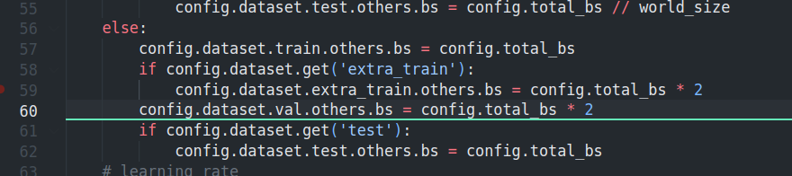

## 文件功能
* parser.py 存储了模型训练所使用的参数
* 


## 代码解析
main.py文件，高亮处的代码未理解


## 整体训练逻辑

核心思想：
main.py 入口文件
1. 加载参数
2. 判断是否分布式训练
3. 学习率, Batchsize计算
4. log信息记录
5. 随机种子记录
6. 开始预训练 pre-training

```python

def main():
    
    # args
    args = parser.get_args()
    # CUDA
    args.use_gpu = torch.cuda.is_available()
    if args.use_gpu:
        torch.backends.cudnn.benchmark = True
    # init distributed env first, since logger depends on the dist info.
    if args.launcher == 'none':
        args.distributed = False
    else:
        args.distributed = True
        dist_utils.init_dist(args.launcher)
        # re-set gpu_ids with distributed training mode
        _, world_size = dist_utils.get_dist_info()
        args.world_size = world_size
    # logger
    timestamp = time.strftime('%Y%m%d_%H%M%S', time.localtime())
    log_file = os.path.join(args.experiment_path, f'{timestamp}.log')
    logger = get_root_logger(log_file=log_file, name=args.log_name)
    # config
    config = get_config(args, logger = logger)
    # define the tensorboard writer
    if not args.test:
        if args.local_rank == 0:
            if args.wandb:
                run = wandb.init(project='pretrain', entity="pimae", sync_tensorboard=True, config=config)
            train_writer = SummaryWriter(os.path.join(args.tfboard_path, 'train'))
            val_writer = SummaryWriter(os.path.join(args.tfboard_path, 'test'))
        else:
            train_writer = None
            val_writer = None
    # batch size
    if args.distributed:
        assert config.total_bs % world_size == 0
        config.dataset.train.others.bs = config.total_bs // world_size
        if config.dataset.get('extra_train'):
            config.dataset.extra_train.others.bs = config.total_bs // world_size * 2
        config.dataset.val.others.bs = config.total_bs // world_size * 2
        if config.dataset.get('test'):
            config.dataset.test.others.bs = config.total_bs // world_size     
    else:
        config.dataset.train.others.bs = config.total_bs
        if config.dataset.get('extra_train'):
            config.dataset.extra_train.others.bs = config.total_bs * 2
        config.dataset.val.others.bs = config.total_bs * 2
        if config.dataset.get('test'):
            config.dataset.test.others.bs = config.total_bs 
    # learning rate
    config.optimizer.kwargs.lr = config.optimizer.kwargs.lr * config.total_bs * config.step_per_update / 256
    # log 
    log_args_to_file(args, 'args', logger = logger)
    log_config_to_file(config, 'config', logger = logger)
    # exit()
    logger.info(f'Distributed training: {args.distributed}')
    # set random seeds
    if args.seed is not None:
        logger.info(f'Set random seed to {args.seed}, '
                    f'deterministic: {args.deterministic}')
        misc.set_random_seed(args.seed + args.local_rank, deterministic=args.deterministic) # seed + rank, for augmentation
    if args.distributed:
        assert args.local_rank == torch.distributed.get_rank() 

    # run
    pretrain(args, config, train_writer, val_writer)
```


runner_pretrain.py预训练文件
开始预训练，逻辑如下：
1. 根据split字段构造训练集或者测试集的dataloader和sampler，train需要shuffle，test不需要shuffle。
```python
def run_net(args, config, train_writer=None, val_writer=None):
    logger = get_logger(args.log_name)
    # build dataset
    datasets, dataset_config = build_dataset(config)
     
    dataloaders = {}
    if args.test:
        dataset_splits = ["test"]
    else:
        dataset_splits = ["train", "test"]
    for split in dataset_splits:
        if split == "train":
            shuffle = True
            bs = config.dataset.train.others.bs
        else:
            shuffle = False
            bs = config.dataset.test.others.bs
        if args.distributed:
            sampler = DistributedSampler(datasets[split], shuffle=shuffle)
        elif shuffle:
            sampler = torch.utils.data.RandomSampler(datasets[split])
        else:
            sampler = torch.utils.data.SequentialSampler(datasets[split])

        dataloaders[split] = DataLoader(
            datasets[split],
            sampler=sampler,
            batch_size=bs,
            num_workers=int(args.num_workers),
            worker_init_fn=misc.worker_init_fn,
            pin_memory=False,
        )
        dataloaders[split + "_sampler"] = sampler

    train_sampler = dataloaders['train_sampler']
    train_dataloader = dataloaders['train']
```

接下来，构造PiMAE模型
```python
base_model = build_multimae(config, args, logger)
```
调用以下代码：
```python

def build_multimae(config, args, logger):
    # point cloud branch
    pointmae_model = build_model_from_cfg(config.pc_model)
    # image branch
    mae_model = models_mae.build_mae_from_cfg(config.img_model, norm_pix_loss=args.norm_pix_loss, img_size=args.img_size)
    # PiMAE
    model = PiMAE(pointmae_model, mae_model, config.joint_model)
        
    return model
```
上述PiMAE模型可直接作为baseline使用。具体模型信息如下：
```json
PiMAE(
  (distill_loss): MSELoss()
  (pc_branch): Point_MAE(
    (MAE_encoder): MaskTransformer(
      (encoder): Encoder(
        (first_conv): Sequential(
          (0): Conv1d(3, 128, kernel_size=(1,), stride=(1,))
          (1): BatchNorm1d(128, eps=1e-05, momentum=0.1, affine=True, track_running_stats=True)
          (2): ReLU()
          (3): Conv1d(128, 256, kernel_size=(1,), stride=(1,))
        )
        (second_conv): Sequential(
          (0): Conv1d(512, 512, kernel_size=(1,), stride=(1,))
          (1): BatchNorm1d(512, eps=1e-05, momentum=0.1, affine=True, track_running_stats=True)
          (2): ReLU()
          (3): Conv1d(512, 256, kernel_size=(1,), stride=(1,))
        )
      )
      (pos_embed): Sequential(
        (0): Linear(in_features=3, out_features=128, bias=True)
        (1): GELU(approximate='none')
        (2): Linear(in_features=128, out_features=256, bias=True)
      )
      (blocks): TransformerEncoder(
        (layers): ModuleList(
          (0): TransformerEncoderLayer(
            attn_dr=0.1
            (self_attn): MultiheadAttention(
              (out_proj): NonDynamicallyQuantizableLinear(in_features=256, out_features=256, bias=True)
            )
            (linear1): Linear(in_features=256, out_features=128, bias=True)
            (dropout): Dropout(p=0.1, inplace=False)
            (linear2): Linear(in_features=128, out_features=256, bias=True)
            (norm2): LayerNorm((256,), eps=1e-05, elementwise_affine=True)
            (dropout2): Dropout(p=0.1, inplace=False)
            (norm1): LayerNorm((256,), eps=1e-05, elementwise_affine=True)
            (dropout1): Dropout(p=0.1, inplace=False)
            (activation): ReLU()
          )
          (1): TransformerEncoderLayer(
            attn_dr=0.1
            (self_attn): MultiheadAttention(
              (out_proj): NonDynamicallyQuantizableLinear(in_features=256, out_features=256, bias=True)
            )
            (linear1): Linear(in_features=256, out_features=128, bias=True)
            (dropout): Dropout(p=0.1, inplace=False)
            (linear2): Linear(in_features=128, out_features=256, bias=True)
            (norm2): LayerNorm((256,), eps=1e-05, elementwise_affine=True)
            (dropout2): Dropout(p=0.1, inplace=False)
            (norm1): LayerNorm((256,), eps=1e-05, elementwise_affine=True)
            (dropout1): Dropout(p=0.1, inplace=False)
            (activation): ReLU()
          )
          (2): TransformerEncoderLayer(
            attn_dr=0.1
            (self_attn): MultiheadAttention(
              (out_proj): NonDynamicallyQuantizableLinear(in_features=256, out_features=256, bias=True)
            )
            (linear1): Linear(in_features=256, out_features=128, bias=True)
            (dropout): Dropout(p=0.1, inplace=False)
            (linear2): Linear(in_features=128, out_features=256, bias=True)
            (norm2): LayerNorm((256,), eps=1e-05, elementwise_affine=True)
            (dropout2): Dropout(p=0.1, inplace=False)
            (norm1): LayerNorm((256,), eps=1e-05, elementwise_affine=True)
            (dropout1): Dropout(p=0.1, inplace=False)
            (activation): ReLU()
          )
        )
      )
      (norm): LayerNorm((256,), eps=1e-05, elementwise_affine=True)
    )
    (decoder_pos_embed): Sequential(
      (0): Linear(in_features=3, out_features=128, bias=True)
      (1): GELU(approximate='none')
      (2): Linear(in_features=128, out_features=192, bias=True)
    )
    (MAE_decoder): TransformerDecoder(
      (blocks): ModuleList(
        (0): Block(
          (norm1): LayerNorm((192,), eps=1e-05, elementwise_affine=True)
          (drop_path): Identity()
          (norm2): LayerNorm((192,), eps=1e-05, elementwise_affine=True)
          (mlp): Mlp(
            (fc1): Linear(in_features=192, out_features=768, bias=True)
            (act): GELU(approximate='none')
            (fc2): Linear(in_features=768, out_features=192, bias=True)
            (drop): Dropout(p=0.0, inplace=False)
          )
          (attn): Attention(
            (qkv): Linear(in_features=192, out_features=576, bias=False)
            (attn_drop): Dropout(p=0.0, inplace=False)
            (proj): Linear(in_features=192, out_features=192, bias=True)
            (proj_drop): Dropout(p=0.0, inplace=False)
          )
        )
        (1): Block(
          (norm1): LayerNorm((192,), eps=1e-05, elementwise_affine=True)
          (drop_path): DropPath()
          (norm2): LayerNorm((192,), eps=1e-05, elementwise_affine=True)
          (mlp): Mlp(
            (fc1): Linear(in_features=192, out_features=768, bias=True)
            (act): GELU(approximate='none')
            (fc2): Linear(in_features=768, out_features=192, bias=True)
            (drop): Dropout(p=0.0, inplace=False)
          )
          (attn): Attention(
            (qkv): Linear(in_features=192, out_features=576, bias=False)
            (attn_drop): Dropout(p=0.0, inplace=False)
            (proj): Linear(in_features=192, out_features=192, bias=True)
            (proj_drop): Dropout(p=0.0, inplace=False)
          )
        )
      )
      (norm): LayerNorm((192,), eps=1e-05, elementwise_affine=True)
      (head): Identity()
    )
    (group_divider): Group(
      (knn): KNN()
    )
    (decoder_embed): Linear(in_features=256, out_features=192, bias=True)
    (increase_dim): Sequential(
      (0): Conv1d(192, 96, kernel_size=(1,), stride=(1,))
    )
    (loss_func): ChamferDistanceL2()
  )
  (img_branch): MaskedAutoencoderViT(
    (patch_embed): PatchEmbed(
      (proj): Conv2d(3, 256, kernel_size=(16, 16), stride=(16, 16))
      (norm): Identity()
    )
    (blocks): ModuleList(
      (0): Block(
        (norm1): LayerNorm((256,), eps=1e-06, elementwise_affine=True)
        (attn): Attention(
          (qkv): Linear(in_features=256, out_features=768, bias=True)
          (attn_drop): Dropout(p=0.0, inplace=False)
          (proj): Linear(in_features=256, out_features=256, bias=True)
          (proj_drop): Dropout(p=0.0, inplace=False)
        )
        (drop_path): Identity()
        (norm2): LayerNorm((256,), eps=1e-06, elementwise_affine=True)
        (mlp): Mlp(
          (fc1): Linear(in_features=256, out_features=1024, bias=True)
          (act): GELU(approximate='none')
          (fc2): Linear(in_features=1024, out_features=256, bias=True)
          (drop): Dropout(p=0.0, inplace=False)
        )
      )
      (1): Block(
        (norm1): LayerNorm((256,), eps=1e-06, elementwise_affine=True)
        (attn): Attention(
          (qkv): Linear(in_features=256, out_features=768, bias=True)
          (attn_drop): Dropout(p=0.0, inplace=False)
          (proj): Linear(in_features=256, out_features=256, bias=True)
          (proj_drop): Dropout(p=0.0, inplace=False)
        )
        (drop_path): Identity()
        (norm2): LayerNorm((256,), eps=1e-06, elementwise_affine=True)
        (mlp): Mlp(
          (fc1): Linear(in_features=256, out_features=1024, bias=True)
          (act): GELU(approximate='none')
          (fc2): Linear(in_features=1024, out_features=256, bias=True)
          (drop): Dropout(p=0.0, inplace=False)
        )
      )
      (2): Block(
        (norm1): LayerNorm((256,), eps=1e-06, elementwise_affine=True)
        (attn): Attention(
          (qkv): Linear(in_features=256, out_features=768, bias=True)
          (attn_drop): Dropout(p=0.0, inplace=False)
          (proj): Linear(in_features=256, out_features=256, bias=True)
          (proj_drop): Dropout(p=0.0, inplace=False)
        )
        (drop_path): Identity()
        (norm2): LayerNorm((256,), eps=1e-06, elementwise_affine=True)
        (mlp): Mlp(
          (fc1): Linear(in_features=256, out_features=1024, bias=True)
          (act): GELU(approximate='none')
          (fc2): Linear(in_features=1024, out_features=256, bias=True)
          (drop): Dropout(p=0.0, inplace=False)
        )
      )
    )
    (norm): LayerNorm((256,), eps=1e-06, elementwise_affine=True)
    (decoder_embed): Linear(in_features=256, out_features=192, bias=True)
    (decoder_blocks): ModuleList(
      (0): Block(
        (norm1): LayerNorm((192,), eps=1e-06, elementwise_affine=True)
        (attn): Attention(
          (qkv): Linear(in_features=192, out_features=576, bias=True)
          (attn_drop): Dropout(p=0.0, inplace=False)
          (proj): Linear(in_features=192, out_features=192, bias=True)
          (proj_drop): Dropout(p=0.0, inplace=False)
        )
        (drop_path): Identity()
        (norm2): LayerNorm((192,), eps=1e-06, elementwise_affine=True)
        (mlp): Mlp(
          (fc1): Linear(in_features=192, out_features=768, bias=True)
          (act): GELU(approximate='none')
          (fc2): Linear(in_features=768, out_features=192, bias=True)
          (drop): Dropout(p=0.0, inplace=False)
        )
      )
      (1): Block(
        (norm1): LayerNorm((192,), eps=1e-06, elementwise_affine=True)
        (attn): Attention(
          (qkv): Linear(in_features=192, out_features=576, bias=True)
          (attn_drop): Dropout(p=0.0, inplace=False)
          (proj): Linear(in_features=192, out_features=192, bias=True)
          (proj_drop): Dropout(p=0.0, inplace=False)
        )
        (drop_path): Identity()
        (norm2): LayerNorm((192,), eps=1e-06, elementwise_affine=True)
        (mlp): Mlp(
          (fc1): Linear(in_features=192, out_features=768, bias=True)
          (act): GELU(approximate='none')
          (fc2): Linear(in_features=768, out_features=192, bias=True)
          (drop): Dropout(p=0.0, inplace=False)
        )
      )
    )
    (decoder_norm): LayerNorm((192,), eps=1e-06, elementwise_affine=True)
    (decoder_pred): Linear(in_features=192, out_features=768, bias=True)
  )
  (increase_dim_feat): Sequential(
    (0): Conv1d(192, 6144, kernel_size=(1,), stride=(1,))
  )
  (blocks): TransformerEncoder(
    (layers): ModuleList(
      (0): TransformerEncoderLayer(
        attn_dr=0.1
        (self_attn): MultiheadAttention(
          (out_proj): NonDynamicallyQuantizableLinear(in_features=256, out_features=256, bias=True)
        )
        (linear1): Linear(in_features=256, out_features=128, bias=True)
        (dropout): Dropout(p=0.1, inplace=False)
        (linear2): Linear(in_features=128, out_features=256, bias=True)
        (norm2): LayerNorm((256,), eps=1e-05, elementwise_affine=True)
        (dropout2): Dropout(p=0.1, inplace=False)
        (norm1): LayerNorm((256,), eps=1e-05, elementwise_affine=True)
        (dropout1): Dropout(p=0.1, inplace=False)
        (activation): ReLU()
      )
      (1): TransformerEncoderLayer(
        attn_dr=0.1
        (self_attn): MultiheadAttention(
          (out_proj): NonDynamicallyQuantizableLinear(in_features=256, out_features=256, bias=True)
        )
        (linear1): Linear(in_features=256, out_features=128, bias=True)
        (dropout): Dropout(p=0.1, inplace=False)
        (linear2): Linear(in_features=128, out_features=256, bias=True)
        (norm2): LayerNorm((256,), eps=1e-05, elementwise_affine=True)
        (dropout2): Dropout(p=0.1, inplace=False)
        (norm1): LayerNorm((256,), eps=1e-05, elementwise_affine=True)
        (dropout1): Dropout(p=0.1, inplace=False)
        (activation): ReLU()
      )
      (2): TransformerEncoderLayer(
        attn_dr=0.1
        (self_attn): MultiheadAttention(
          (out_proj): NonDynamicallyQuantizableLinear(in_features=256, out_features=256, bias=True)
        )
        (linear1): Linear(in_features=256, out_features=128, bias=True)
        (dropout): Dropout(p=0.1, inplace=False)
        (linear2): Linear(in_features=128, out_features=256, bias=True)
        (norm2): LayerNorm((256,), eps=1e-05, elementwise_affine=True)
        (dropout2): Dropout(p=0.1, inplace=False)
        (norm1): LayerNorm((256,), eps=1e-05, elementwise_affine=True)
        (dropout1): Dropout(p=0.1, inplace=False)
        (activation): ReLU()
      )
    )
  )
  (norm): LayerNorm((256,), eps=1e-06, elementwise_affine=True)
  (decoder_blocks): ModuleList(
    (0): Block(
      (norm1): LayerNorm((192,), eps=1e-06, elementwise_affine=True)
      (attn): Attention(
        (qkv): Linear(in_features=192, out_features=576, bias=True)
        (attn_drop): Dropout(p=0.0, inplace=False)
        (proj): Linear(in_features=192, out_features=192, bias=True)
        (proj_drop): Dropout(p=0.0, inplace=False)
      )
      (drop_path): Identity()
      (norm2): LayerNorm((192,), eps=1e-06, elementwise_affine=True)
      (mlp): Mlp(
        (fc1): Linear(in_features=192, out_features=768, bias=True)
        (act): GELU(approximate='none')
        (fc2): Linear(in_features=768, out_features=192, bias=True)
        (drop): Dropout(p=0.0, inplace=False)
      )
    )
  )
  (decoder_norm): LayerNorm((192,), eps=1e-06, elementwise_affine=True)
)
```
接下来，解析PiMAE内部的构造模块。
