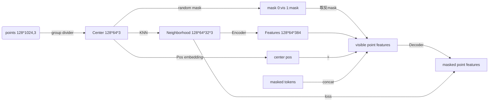

## Random Mask部分代码调试

```mermaid
graph LR
Inputs(points 128*1024,3) 
Center--->|KNN|neighborhood[Neighborhood 128*64*32*3]
Inputs --->|group divider|Center[Center 128*64*3]
Center --->|random mask| Mask[mask 0:vis 1:mask]
neighborhood --->|Encoder| Feature[Features 128*64*384]
Mask ---> |取反mask| Visible[visible point features]
Feature --->Visible[visible point features]
Visible --->|Decoder| masked[masked point features]
Center --->|Pos embedding| Pos[center pos] --->|+| Visible[visible point features]
Masked[masked tokens] --->|concat| Visible[visible point features]
neighborhood--->|loss| masked


```