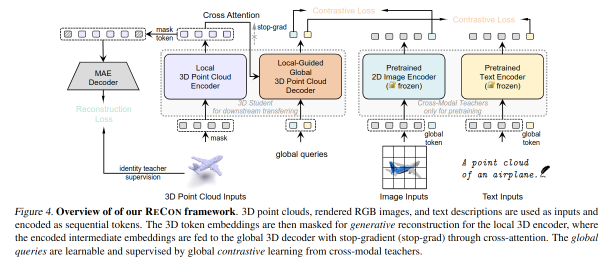

## Contrast with Reconstruct: Contrastive 3D Representation Learning Guided by Generative Pretraining
本文是2023.02.05挂到ArXiv上的文章，是目前3D点云预训练的SOTA工作。其核心思想就是利用mask learning和contrastive learning的优势进行有机结合，实现性能的提升。

### 动机
作者做了一些有趣的实验，分别证明了掩码学习和对比学习的特点和学习模式上的差异。

左图：x轴为预训练数据的比例，y轴是预训练之后的模型在ScanObjectNN数据集上微调的准确度。
1. 首先看菱形红线，表示的是CMC对比学习预训练的情况。可以发现，数据越少，下游性能越差。
2. 其次看圆形蓝线，表示的是mask learning预训练的情况，可以发现，即使数据少，但是但不至于像对比学习那么差。
3. 最后看三角绿线，表示的是mask learning和对比学习的简单结合，可以发现，其效果并不好，低于base line mask learning(圆形蓝线)。

上述实验说明：
1. 对比学习非常吃数据，数据量太小，预训练不完全，下游任务很差，在小数据集上非常容易过拟合。
2. 掩码学习对数据并不敏感，即使在数据量较小的情况下，性能也不差。

此外，对比学习更关注全局关系，掩码学习则更关注局部的区域学习。

上图便是他的方法图。

左侧是MAE，直接对输入的点云进行掩码，然后经过decoder解码进行重建。
右侧是cross-modal contrastive learning模块，分别包括了文本编码器和图像编码器。
中间部分，首先左侧是点云编码器，对输入的masked 点云进行编码，其右侧是一个结构一致的decoder,二者之间依靠cross-attention进行链接。编码器输出的embedding也会传入解码器，配合query得到两个global输出，分别和右侧对比学习模块进行cross-modal contrastive learning.
有一个细节：可以发现，cross-attention是stop-grad的，也就是说此处的信息是单向的（encoder->decoder），为什么不可以双向呢？这是因为如果双向，左侧的掩码学习就能看见右侧的全局信息，mask learning可能就会找到一个shortcut，从而学不到好的表征信息。

---

## Efficient Masked Autoencoders with Self-Consistency

### insights:
1. 为什么MAE相较于BERT，需要很长的预训练epoch?
    * MAE 1600 vs BERT 40
        * 由于mask ratio的不同，导致二者对于信息的利用率不同。high mask ratio的MAE可利用的图像信息太少，因此需要更多的epoch

