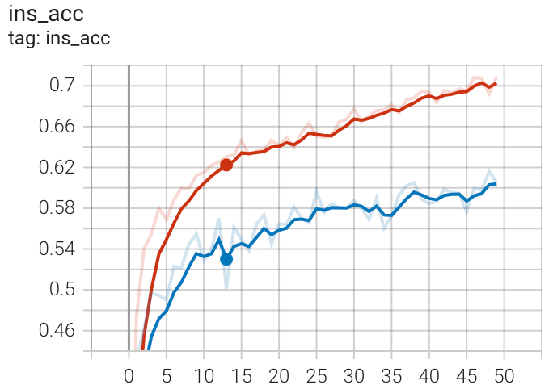

# 实验记录

## Stable Diffusion的预训练知识能否用于3D分类？
**实验细节**：
1. 采用预训练的Stable Diffusion模型，主要是Unet网络。预训练权重采用的是V1-5.
2. UNet的输入是图像和文本
3. 3D数据集采用的是ModelNet10，每一个对应的3D点云采用render的方式得到对应的图像（目前只采用了正面视角）
4. 输入图像和所有的类别文本至Unet，得到网络的最后一层的output，接不同的classification head实现。
5. 训练过程中，Unet均保持冻结状态。


**实验一 UNet+单层MLP**
```python
# 单层MLP
class filter_net(nn.Module):
    def __init__(self,cfg):
        super(filter_net, self).__init__()
        self.fc = nn.Linear(1024, cfg.data.pc_num_category)
    def forward(self,x):
        x = self.fc(x)
        x = F.log_softmax(x, -1)
        return x
```


| Model  | Data Aug| Instance Acc| Class Acc|
|---|---|--- | ---|
| UNet+MLP  | Resize+RCrop+RHFlip  | 47.7 | 43.72 |


**实验二 UNet+多层MLP**
```python

class filter_net(nn.Module):
    def __init__(self,cfg):
        super(filter_net, self).__init__()
        self.fc1 = nn.Linear(1024, 512)
        self.bn1 = nn.BatchNorm1d(512)
        self.drop1 = nn.Dropout(0.4)
        self.fc2 = nn.Linear(512, 256)
        self.bn2 = nn.BatchNorm1d(256)
        self.drop2 = nn.Dropout(0.4)
        self.fc3 = nn.Linear(256, cfg.data.pc_num_category)

    def forward(self,x):
        x = self.drop1(F.relu(self.bn1(self.fc1(x))))
        x = self.drop2(F.relu(self.bn2(self.fc2(x))))
        x = self.fc3(x)
        x = F.log_softmax(x, -1)
        
        return x
```

| Model  | Data Aug| Instance Acc| Class Acc|
|---|---|--- | ---|
| UNet+MLP  | Resize+RCrop+RHFlip  | 61.4 | 56.84 |





**实验三 UNet+MLP+更少的Aug**
```python

class filter_net(nn.Module):
    def __init__(self,cfg):
        super(filter_net, self).__init__()
        self.fc1 = nn.Linear(1024, 512)
        self.bn1 = nn.BatchNorm1d(512)
        self.drop1 = nn.Dropout(0.4)
        self.fc2 = nn.Linear(512, 256)
        self.bn2 = nn.BatchNorm1d(256)
        self.drop2 = nn.Dropout(0.4)
        self.fc3 = nn.Linear(256, cfg.data.pc_num_category)

    def forward(self,x):
        x = self.drop1(F.relu(self.bn1(self.fc1(x))))
        x = self.drop2(F.relu(self.bn2(self.fc2(x))))
        x = self.fc3(x)
        x = F.log_softmax(x, -1)
        
        return x
```

| Model  | Data Aug| Instance Acc| Class Acc|
|---|---|--- | ---|
| UNet+MLP  | Resize+RHFlip  | 71.38 | 68.56 |


