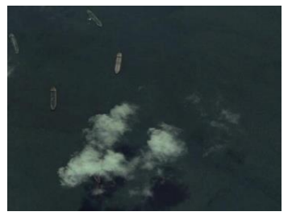
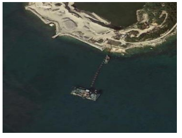
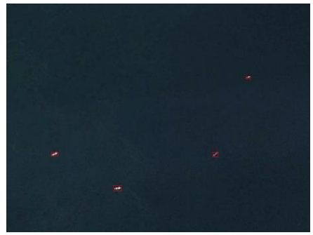
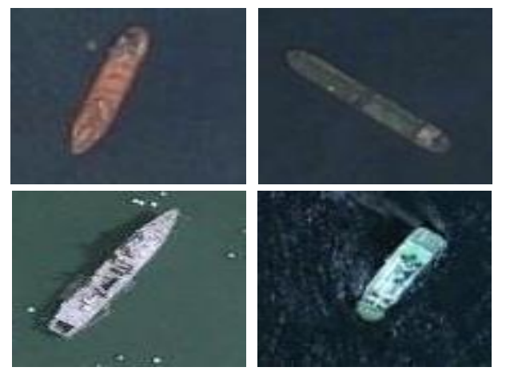
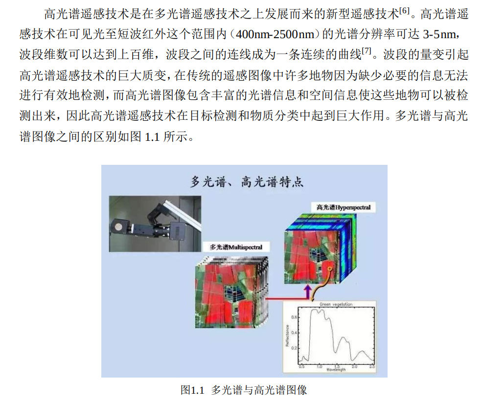
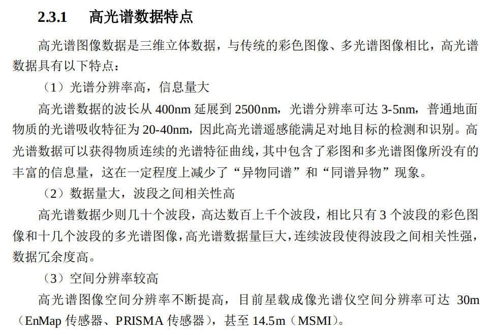

## GF项目背景需求调研

### 融合物理规律的多谱段目标图像生成及测评方法

#### 场景一：基于多谱段数据的海上目标检测与识别
**海上目标检测与识别**是**重点海域监控、军事目标探查、精准定位打击**等航海领域的关键任务。

**挑战**
* 背景干扰多，环境干扰强，目标信号弱，目标类型复杂，
* 真实数据稀缺，数据标注困难，模型性能不足
<figure>

</figure> 
&nbsp;&nbsp;&nbsp;&nbsp;&nbsp;&nbsp;&nbsp;&nbsp;&nbsp;&nbsp;&nbsp;&nbsp;&nbsp;&nbsp;&nbsp;&nbsp;&nbsp;&nbsp;&nbsp;高背景干扰下的多目标检测  &nbsp;&nbsp;&nbsp;&nbsp;&nbsp;&nbsp;&nbsp;&nbsp;&nbsp;&nbsp;&nbsp;&nbsp;&nbsp;&nbsp;&nbsp;&nbsp;&nbsp;&nbsp;&nbsp;&nbsp;&nbsp;&nbsp;&nbsp;&nbsp;&nbsp;&nbsp;&nbsp;&nbsp;   抗人为干扰下的检测识别 &nbsp;&nbsp;&nbsp;&nbsp;&nbsp;&nbsp;&nbsp;&nbsp;&nbsp;&nbsp;&nbsp;&nbsp;&nbsp;&nbsp;&nbsp;&nbsp;&nbsp;&nbsp;&nbsp;&nbsp;&nbsp;&nbsp;&nbsp;&nbsp;&nbsp;&nbsp;&nbsp;&nbsp;&nbsp;极小目标的检测识别 &nbsp;&nbsp;&nbsp;&nbsp;&nbsp;&nbsp;&nbsp;&nbsp;&nbsp;&nbsp;&nbsp;&nbsp;&nbsp;&nbsp;&nbsp;&nbsp;&nbsp;&nbsp;&nbsp;&nbsp;&nbsp;&nbsp;&nbsp;&nbsp;&nbsp;&nbsp;&nbsp;&nbsp;&nbsp;&nbsp;&nbsp;&nbsp;&nbsp;&nbsp;目标类型复杂的检测识别     

**下游任务**
1. 复杂背景下的多目标检测定位识别 (可见光遥感图像数据)
2. 伪装军事目标检测（高光谱图像数据）
3. 水下目标检测 （高光谱图像数据）
3. 导弹预警（红外数据）

物理规律如何满足：
1. 多目标场景下，多舰艇之间的空间位置关系
    * 比如航母战斗群不会一字排开
2. 单目标场景下，舰艇舰身刚性约束

参考：
1. https://kns.cnki.net/kcms2/article/abstract?v=3uoqIhG8C447WN1SO36whLpCgh0R0Z-iszBRSG4W40qHYXhao9i2hlujA5fuMTsnswSp5p8J_yX2cah1efE6Sb4jqBlvthFZ&uniplatform=NZKPT
2. https://zhuanlan.zhihu.com/p/389875609

#### 场景二：基于多谱段数据的低空地面目标检测

**挑战**：
* 背景干扰多，环境干扰强，目标信号弱，目标类型复杂，
* 真实数据稀缺，数据标注困难，模型性能不足

**下游任务**
1. 复杂背景下，重点区域识别
2. 

老师的想法：
对增强的数据进行评测 需要通用的方法。
可用于海上，空中，地面。
对于目标检测的增强算法的数据评测。
对于打击任务中的目标检测，目标可以是海上，空中，地面。
细粒度的识别，军官 士兵，坦克，装甲车

目标可以是几类：
飞机
战车
人
军舰

这样的话，任意的数据集都可以来做增强。但是是否有效，我们就要评测这些数据。
目标检测的增强，GAN，得到局部的目标。

多谱段图像+聚焦打击任务+不具体的场景
为打击任务，执行目标检测，多种数据进行增强，评判增强的数据质量。

打击目标任务+生成数据+数据评测
飞机
战车
人
军舰
建筑

如何对生成的数据，或者

物理规律找出共同点
2，3个物理规律
光照 大气（能见度） 遮挡物，再找到两点
在生成的图像，关注物理规律，进行评测

考虑物理规律的生成
新生成多个视角三维一致性

multi-head 鉴别器 每一个head去鉴别一个物理规律 

