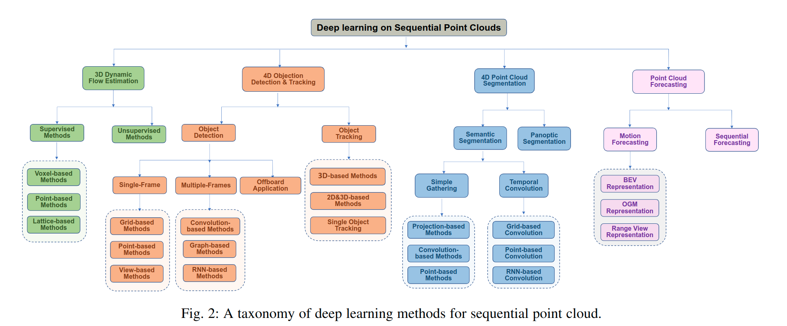

## Paper List

### 4D自监督表征学习
1. Complete-to-Partial 4D Distillation for Self-Supervised Point Cloud Sequence Representation Learning, CVPR 2023 YiLi
    * 解决的问题：其他工作都是在静态的3D点云数据下进行自监督学习，没有人搞动态的3D点云自监督学习。
    * 第一篇面向动态场景理解的4D点云表征学习工作
2. 4DContrast: Contrastive Learning with Dynamic Correspondences for 3D Scene Understanding，2022.06.22（4D的预训练，3D的任务）
    * 解决的问题：发现点云的运动也是可以促进3D内容理解的。
3. Spatio-temporal Self-Supervised Representation Learning for 3D Point Clouds，2021.09.01（4D的预训练，3D的任务）
    * 解决的问题：发现之前的方法都是在固定视角下的预训练，泛化性很差 
    * 研究两个不同时刻的点云frame之间的不变性。可以理解为点云的多个视角之间的对比学习

## 4D点云理解

没有被解决的问题：
1. 4D点云的自监督表征学习目前处于起步阶段，可以从很多方面出发设计改进。
    * 多模态+Multifold+4D点云

### 自动驾驶领域

自动驾驶领域4D点云理解的发展现状？

自监督+4D点云+多模态

1. （First work）MeteorNet: Deep Learning on Dynamic 3D Point Cloud Sequences，ICCV 2019
2. PointRNN: Point Recurrent Neural Network for Moving Point Cloud Processing, 2019
3. PointCMP: Contrastive Mask Prediction for Self-supervised Learning on Point Cloud Videos, 2023.05.06
1. Argoverse 2: Next Generation Datasets for Self-Driving Perception and Forecasting，2023.01.02
2. LiDAR-based 4D Panoptic Segmentation via Dynamic Shifting Network
3. Point 4D Transformer Networks for Spatio-Temporal Modeling in Point Cloud Videos
4. MeteorNet: Deep Learning on Dynamic 3D Point Cloud Sequences, 2019.10

## 动态点云 | 点云视频 | 点云序列调研

**Survey**
1. Sequential Point Clouds: A Survey
    * 该论文中主要介绍了一些解决序列点云任务的工作，包括分割、检测等。
    * 原始论文中提到目前 **unsupervised point cloud video learning**还没有被完全探索，更多的方法依赖于标注信息。
    * 长时依赖问题还没有被完全解决
    * 多任务学习

**几个方面**
* **scene motion learning**
> Scene motion is a fine-grained representation of the motion pattern, which is defined as a 3D displacement vector between each point in two sequential frames
> Pillar representation
1. ContrastMotion: Self-supervised Scene Motion Learning for Large-Scale LiDAR Point Clouds, 2023.04.25
    * KITTI Scene Flow, nuScenes
    * Scene Flow, Motion Prediction
    * 解决问题：之前的方法，大家都是基于point-wise feature extraction, 对于large-scale的点云来说计算和内存消耗太大。之前的方法依赖data-level级别的结构一致性，但是由于视角改变，相邻帧之间的点云missing很多。
2. Self-Point-Flow: Self-Supervised Scene Flow Estimation from Point Clouds with Optimal Transport and Random Walk, 2021.05
3. RCP: Recurrent Closest Point for Point Cloud, CVPR 2022
4. SLIM: Self-Supervised LiDAR Scene Flow and Motion Segmentation,ICCV 2021
5. Self-Supervised Pillar Motion Learning for Autonomous Driving, 2021.04

* **点云视频理解**

**Other representations based**
1. Fast and Furious: Real Time End-to-End 3D Detection, Tracking and Motion Forecasting with a Single Convolutional Net (BEV based)
2. 4D Spatio-Temporal ConvNets: Minkowski Convolutional Neural Networks, (Voxel based)
3. Action4D: Online Action Recognition in the Crowd and Clutter (Voxel based)
4. LiDAR-based Online 3D Video Object Detection with Graph-based Message Passing and Spatiotemporal Transformer Attention (pillar grid based)

**Raw point cloud based**
1. Point Primitive Transformer for Long-Term 4D Point Cloud Video Understanding
2. Spatial-Temporal Transformer for 3D Point Cloud Sequences
3. Deep Hierarchical Representation of Point Cloud Videos via Spatio-Temporal Decomposition
4. Point Spatio-Temporal Transformer Networks for Point Cloud Video Modeling
5. Point 4D Transformer Networks for Spatio-Temporal Modeling in Point Cloud Videos
    * utilizes point spatio-temporal tubes to aggregate local neighborhoods into tokens.
6. PSTNet: Point Spatio-Temporal Convolution on Point Cloud Sequences
    * proposed a spatio-temporal decoupled encoder, which alternately performs spatial and temporal convolution to model raw point sequences hierarchically.
7. Deep Hierarchical Representation of Point Cloud Videos via Spatio-Temporal Decomposition
8. MeteorNet: Deep Learning on Dynamic 3D Point Cloud Sequences
9. 3DV: 3D Dynamic Voxel for Action Recognition in Depth Video
10. No Pain, Big Gain: Classify Dynamic Point Cloud Sequences with Static Models by Fitting Feature-level Space-time Surfaces
11. Building Rearticulable Models for Arbitrary 3D Objects from 4D Point Clouds
12. MSF: Motion-guided Sequential Fusion for Efficient 3D Object Detection from Point Cloud Sequences
13. NeuralPCI: Spatio-temporal Neural Field for 3D Point Cloud Multi-frame Non-linear Interpolation
14. Action recognition based on a bag of 3D points, CVPR2011
15. HOI4D: A 4D Egocentric Dataset for Category-Level Human-Object Interaction, CVPR2022
16. The SYNTHIA Dataset: A Large Collection of Synthetic Images for Semantic Segmentation of Urban Scenes, CVPR2016
17. 4DContrast: Contrastive Learning with Dynamic Correspondences for 3D Scene Understanding
18. Spatio-temporal Self-Supervised Representation Learning for 3D Point Clouds

**Raw point cloud based**

4. Point Spatio-Temporal Transformer Networks for Point Cloud Video Modeling, TPAMI23 （无法下载，需要换网络）
10. No Pain, Big Gain: Classify Dynamic Point Cloud Sequences with Static Models by Fitting Feature-level Space-time Surfaces，CVPR2022（待读）
11. Building Rearticulable Models for Arbitrary 3D Objects from 4D Point Clouds，cvpr2023 （全网检索不到）
12. MSF: Motion-guided Sequential Fusion ufor Efficient 3D Object Detection from Point Cloud Sequences
13. NeuralPCI: Spatio-temporal Neural Field for 3D Point Cloud Multi-frame Non-linear Interpolation
14. Action recognition based on a bag of 3D points, CVPR2011
15. HOI4D: A 4D Egocentric Dataset for Category-Level Human-Object Interaction, CVPR2022
16. The SYNTHIA Dataset: A Large Collection of Synthetic Images for Semantic Segmentation of Urban Scenes, CVPR2016
17. 4DContrast: Contrastive Learning with Dynamic Correspondences for 3D Scene Understanding

* **点云视频自监督学习**
1. Self-supervised 4D Spatio-temporal Feature Learning via Order Prediction of Sequential Point Cloud Clips
    * designed a pretext task, namely recurrent order prediction (ROP), to predict the temporal order of shuffled point cloud segments for self-supervised learning. However, this method can only capture clip-level temporal structures and cannot exploit finer spatio-temporal details.
2. Complete-to-Partial 4D Distillation for Self-Supervised Point Cloud Sequence Representation Learning
3. Spatiotemporal Self-supervised Learning for Point Clouds in the Wild， cvpr2023
18. Spatio-temporal Self-Supervised Representation Learning for 3D Point Clouds,ICCV 2021
1. PointCMP: Contrastive Mask Prediction for Self-supervised Learning on Point Cloud Videos
2. 4DContrast: Contrastive Learning with Dynamic Correspondences for 3D Scene Understanding

其他知识点：

点云的一些表示：
1. Pillar 
2. Voxel
3. BEV

点云序列的难点：
1. Due to camera motion, scene changes, occlusion changes, and sampling patterns, points between different frames are unstructured and inconsistent, making it difficult to effectively integrate different frames into the underlying spatio-temporal structure

点云视频图例

4D感知任务：

头脑风暴：
1. 解耦空间时间
2. 空间自监督
3. 时间自监督
4. 空间时间融合

