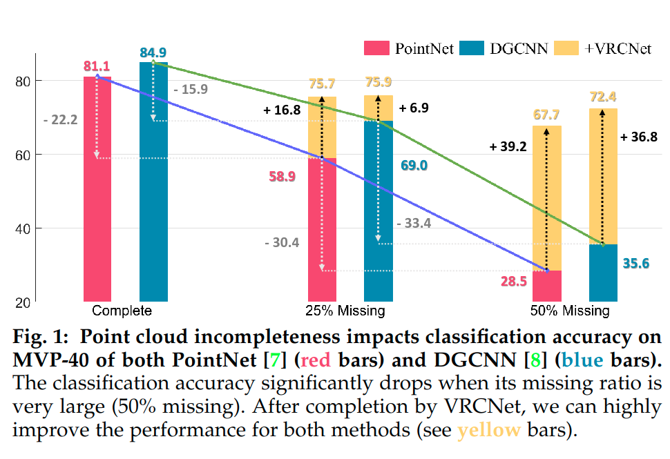
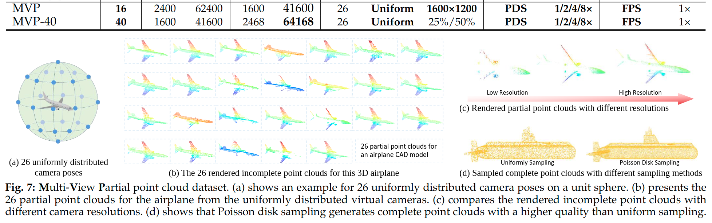

> Variational Relational Point Completion Network for Robust 3D Classification
点云的缺失对网络性能有什么影响：

随着点云缺失比例加大，PointNet等网络的性能显著下降。

本文提出的数据集是什么？

真实世界中的点云是怎样的？
由于扫描过程中的误差、遮挡、噪音干扰等问题，现实世界中的点云往往都是残缺的、不完整的。

相关术语：
partial point cloud：
That is, given a 3D object point cloud, there could be multiple angles to view this data, such that each angle produces a different partial point cloud

Self-Supervised Feature Learning from Partial Point Clouds
via Pose Disentanglement
